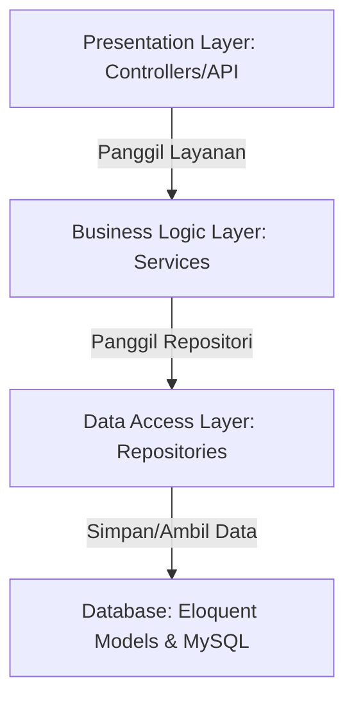

# SPAL (Sistem Peminjaman Alat Laboratorium) &bull; SMKN 2 Palembang

Sistem Peminjaman Alat Laboratorium (SPAL) adalah aplikasi berbasis web modern yang dirancang untuk mendigitalisasi siklus peminjaman, pelacakan inventaris, persetujuan reservasi, dan manajemen pengembalian alat praktik laboratorium di SMKN 2 Palembang.

---

##  KREDENSIAL LOGIN PENGUJIAN (DOSEN / PENGUJI)

Gunakan akun uji coba di bawah ini untuk masuk dan memvalidasi alur kerja sesuai dengan hak akses masing-masing peran.

> [!IMPORTANT]
> **Password Default (Semua Akun):** `password123`

| Peran | Email | Akses & Fungsionalitas Utama |
| :--- | :--- | :--- |
| ** Laboran** (Admin) | `laboran@school.id` | Akses penuh: Dasbor global, Data Alat, Approval, Scan Pengembalian, Riwayat, Laporan, Blacklist. |
| ** Guru** | `guru@school.id` | Katalog alat, reservasi alat, monitoring peminjaman aktif & status pengajuan pribadi. |
| ** Siswa** | `siswa@school.id` | Katalog alat, pengajuan izin peminjaman praktik, melihat riwayat denda & status pengajuan pribadi. |

---

##  AKSES MULTI-PERANGKAT (HP, TABLET, & LAPTOP LAIN)

Aplikasi ini telah dikonfigurasi untuk dapat diakses secara nirkabel dari perangkat lain (seperti HP dosen/penguji) dalam jaringan Wi-Fi yang sama:

* **Tautan Akses HP/Laptop Lain:**
  ```text
  http://192.168.100.121:5174/
  ```

> [!TIP]
> **Akses Kamera QR Scanner di HP:**
> Karena peramban (browser) HP memblokir kamera pada koneksi HTTP remote non-localhost, gunakan **Localtunnel** untuk mendapatkan URL HTTPS aman secara instan. Jalankan perintah di bawah ini pada terminal laptop utama Anda:
> ```bash
> npx localtunnel --port 5174
> ```
> Buka URL HTTPS (misalnya `https://xxx.localtunnel.me`) yang dihasilkan di HP Anda untuk mengaktifkan pemindaian kamera fisik secara instan.

---

##  CARA MENJALANKAN PROJECT

### 1. Prasyarat Sistem
* Node.js & NPM (untuk Frontend)
* PHP 8.2 atau lebih baru (untuk Backend Laravel)
* MySQL / MariaDB (Database server)

### 2. Konfigurasi Backend (Laravel)
1. Masuk ke folder backend:
   ```bash
   cd backend
   ```
2. Salin file `.env` dan atur konfigurasi database Anda:
   ```bash
   cp .env.example .env
   ```
3. Instal dependensi PHP:
   ```bash
   composer install
   ```
4. Generate key aplikasi:
   ```bash
   php artisan key:generate
   ```
5. Jalankan migrasi dan isi data demo awal (55 alat, 35 transaksi demo, & akun default):
   ```bash
   php artisan migrate:fresh --seed
   ```
6. Jalankan server Laravel:
   ```bash
   php artisan serve --host 0.0.0.0 --port 8000
   ```

### 3. Konfigurasi Frontend (Vue 3 + Vite)
1. Masuk ke folder root project (di luar folder backend):
   ```bash
   npm install
   ```
2. Jalankan server pengembangan Vite:
   ```bash
   npm run dev
   ```
3. Akses aplikasi melalui browser di `http://localhost:5174/`.

---

##  PANDUAN DEPLOYMENT (VERCEL & RAILWAY)

Proyek ini telah dikonfigurasi untuk dapat dideploy secara terpisah (Frontend di Vercel dan Backend di Railway) tanpa mengalami masalah CORS.

### 1. Konfigurasi Backend & Database di Railway
1. Masuk ke [Railway](https://railway.app) menggunakan GitHub.
2. Buat proyek baru dan pilih repositori `spal-smkn2`.
3. Pada pengaturan layanan (Service Settings) repositori, atur **Root Directory** ke `/backend`.
4. Tambahkan database MySQL di Railway (**Add** -> **Database** -> **MySQL**).
5. Pada layanan Laravel Anda, hubungkan variabel lingkungan berikut di tab **Variables**:
   * `DB_CONNECTION`: `mysql`
   * `DB_HOST`: `${{MySQL.MYSQLHOST}}`
   * `DB_PORT`: `${{MySQL.MYSQLPORT}}`
   * `DB_DATABASE`: `${{MySQL.MYSQLDATABASE}}`
   * `DB_USERNAME`: `${{MySQL.MYSQLUSER}}`
   * `DB_PASSWORD`: `${{MySQL.MYSQLPASSWORD}}`
   * `APP_KEY`: `base64:Fyy3wpQ227Xt9NUccdKs0yeG0LSF09jKv4B3aWYoenU=`
   * `APP_ENV`: `production`
   * `APP_DEBUG`: `false`
   * `MIGRATION_KEY`: `spal-migrasi-2026`
6. Dapatkan URL publik backend yang dihasilkan oleh Railway di bagian **Domains** (misalnya `https://spal-backend.up.railway.app`).

### 2. Konfigurasi Frontend di Vercel
1. Masuk ke [Vercel](https://vercel.com) menggunakan GitHub.
2. Impor repositori `spal-smkn2`.
3. Atur **Root Directory** ke `./` (root repositori utama, bukan `/backend`). Vercel akan mendeteksi Vite secara otomatis.
4. Sebelum men-deploy atau setelah mendapatkan domain Railway Anda, buka berkas [vercel.json](file:///c:/Users/fihil/OneDrive/Dokumen/from%20yora/Project%20RPL/vercel.json) di root proyek dan ubah bagian `"destination"` agar mengarah ke domain Railway Anda:
   ```json
   "destination": "https://domain-railway-anda.up.railway.app/api/:path*"
   ```
5. Lakukan push perubahan ke GitHub agar Vercel melakukan build otomatis.

### 3. Jalankan Migrasi Database
1. Setelah backend Railway dan database aktif, kunjungi URL berikut melalui browser untuk menjalankan migrasi dan seeding data awal secara otomatis:
   ```text
   https://domain-railway-anda.up.railway.app/api/migrate?key=spal-migrasi-2026
   ```
2. Halaman akan menampilkan respon JSON sukses yang menandakan database telah terisi dengan akun uji coba dan 55 inventaris alat.

---

##  RINGKASAN FITUR UTAMA

### 1. Autentikasi Cardless Asimetris
* Layar masuk (**Login**) & pendaftaran (**Register**) didesain asimetris (1/3 area input di sisi kiri dan 2/3 ruang kosong whitespace di sisi kanan).
* Mengeliminasi kotak shadow card yang kaku. Input dirancang minimalis menggunakan garis bawah yang menebal secara kinetik saat aktif.

### 2. Dasbor Adaptif & Bento Grid
* **Laboran**: Menyajikan widget statistik global inventaris, visualisasi diagram aktivitas peminjaman mingguan, daftar peminjaman aktif, dan tugas verifikasi cepat.
* **Guru & Siswa**: Menyajikan statistik personal (Alat Dipinjam Saya, Pengajuan Pending Saya, Akumulasi Denda Saya), daftar peminjaman aktif pribadi, dan status terbaru pengajuan peminjaman mereka sendiri.
* **Dynamic Category Avatars**: Avatar inisial alat pada daftar dasbor memiliki warna aksen dinamis berdasarkan kategori alat (Biru untuk Laptop/Jaringan, Ungu untuk Proyektor/TV, Amber untuk Kamera/Multimedia, Hijau untuk Alat Solder/Obeng).
* **Penyorotan Keterlambatan**: Baris transaksi berstatus "Terlambat" otomatis diberi warna latar belakang merah pastel tipis agar langsung terlihat oleh pengguna.

### 3. Katalog & Reservasi (Archival Index Style)
* Katalog disajikan dengan gaya indeks arsip lembaran kertas tipis dengan whitespace longgar, membuang kartu model grid box-shadow lama.
* **Progressive Disclosure 2 Langkah**:
  1. Pengguna memilih alat dan melihat jadwal kalender ketersediaan interaktif untuk bulan **Juni 2026**.
  2. Setelah tanggal mulai dan selesai dipilih, formulir isian detail unit dan keperluan praktikum otomatis meluncur turun (slide-down).
* Formulir dilengkapi dengan pop-up notifikasi sukses terkirim yang melayang selama 2 detik sebelum mereset form.

### 4. Persetujuan Peminjaman (Approval)
* Alur kerja verifikasi untuk Laboran yang memisahkan struktur desktop dan mobile:
  - **Desktop**: Pembagian kolom asimetris (Daftar Pengajuan Pending di kiri, riwayat peminjaman sesi ini di kanan). Klik pada baris memicu panel samping (Slide-over panel) untuk detail lengkap.
  - **Mobile**: Tampilan tabbed (Pending vs Riwayat) dengan laci detail meluncur ke atas (bottom sheet drawer).
* **Indikator Kepercayaan (HITL)**: Menyajikan data riwayat kedisiplinan peminjam (misal: "Siswa ini belum pernah terlambat" atau berwarna merah "Pernah terlambat 2 kali") untuk membantu laboran mengambil keputusan persetujuan.
* Tombol penolakan otomatis membuka input alasan penolakan secara dinamis.

### 5. Pengembalian Alat & Manajemen Denda
* **Real Camera QR Scanner**: Memanfaatkan kamera fisik perangkat (via `html5-qrcode`) dengan reticle pembingkai tipis 1px. Mendukung getaran taktil sukses (haptic feedback) dan bunyi bip audio.
* Pemindai mendukung deteksi ganda (dapat memindai QR fisik pada alat maupun ID peminjaman).
* **HITL Control Denda**: Jika alat dikembalikan terlambat, sistem menghitung denda otomatis Rp 10.000/hari. Tombol "Setujui Pengembalian" baru akan aktif setelah laboran mengklik tombol verifikasi denda (HITL).
* **Unggah Kerusakan Dinamis**: Jika kondisi pengembalian diatur ke "Rusak Ringan/Berat", area drag-and-drop foto kerusakan dan input detail kerusakan otomatis terbuka secara progresif.

---

##  ARSITEKTUR LOGIKA BACKEND (4-LAYER PATTERN)

Backend Laravel dirancang menggunakan pemisahan tanggung jawab 4-Layer demi kerapian kode, skalabilitas, dan kemudahan pengujian unit:



1. **Presentation Layer (`app/Http/Controllers/Api`)**:
   * Melayani permintaan HTTP RESTful, validasi input request, dan menyajikan respon JSON terstruktur.
   * Berkas utama: `AuthApiController.php`, `EquipmentApiController.php`, `BorrowingApiController.php`.

2. **Business Logic Layer (`app/Services`)**:
   * Tempat isolasi seluruh logika bisnis sistem, seperti kalkulasi denda, validasi kelayakan reservasi, penomoran QR otomatis, dan delegasi notifikasi.
   * Berkas utama: `BorrowingService.php`, `QrCodeService.php`, `NotificationService.php`.

3. **Data Access Layer (`app/Repositories`)**:
   * Menangani seluruh interaksi kueri database (Eloquent query) untuk memisahkan logika query dari bisnis.
   * Berkas utama: `UserRepository.php`, `EquipmentRepository.php`, `BorrowingRepository.php`, `TransactionRepository.php`.

4. **Database & Infrastructure Layer**:
   * Berisi skema database, scheduler otomatis (`SendBorrowingReminders.php`), dan data seeders untuk mempermudah proses deploy/testing.

---

##  MASTER DESIGN SYSTEM (DESIGN.md SSOT)

Aplikasi SPAL dibangun dengan kepatuhan mutlak pada pedoman visual **`DESIGN.md`**:
* **Base Background**: Warna krem pucat hangat `#F9F7F3` yang menenangkan.
* **Liquid Glassmorphism**: Panel glassmorphic transparan (`rgba(255,255,255,0.7)`) dengan backdrop blur 12px.
* **Aksen Warna**: Menggunakan warna aksen korporat **Steel Blue (`#46708F`)** menggantikan warna biru neon bawaan Tailwind.
* **Typography**: Kontras ukuran ekstrem dengan font display *Instrument Serif* bergaya miring (*italic*) dan font numerik *Geist*.
* **Digital Tactile Interaction**: Umpan balik klik mekanis pada setiap tombol dan row menggunakan efek transisi penciutan scale `transform: scale(0.98)` dalam durasi responsif 0.2 detik.
* **Tanpa Emoji**: Menghindari emoji generik di seluruh antarmuka, digantikan sepenuhnya oleh ikon minimalis dari **Lucide Icons**.
